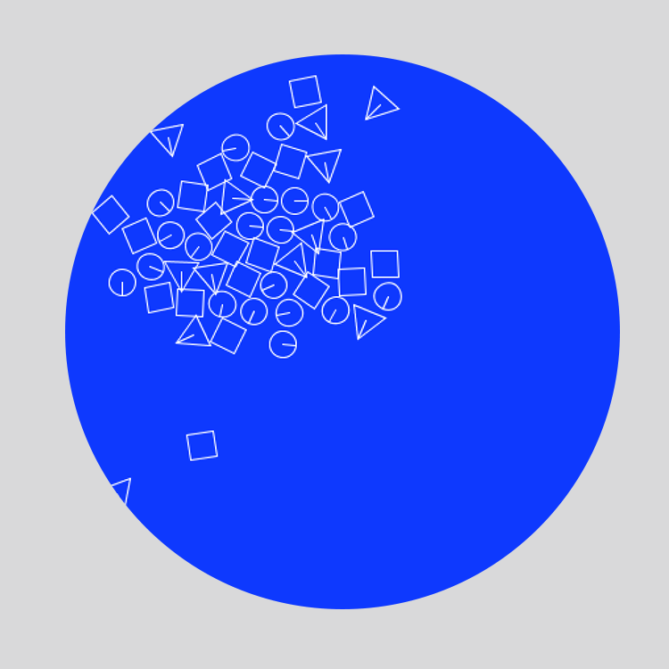

#Micrographia der (digitalen) Mikrowelt

During the course of this class, we have discovered a novel method to observe digital native microcreatures living in a multitude of digital devices. These creatures have been vaguely reported in scientific litterature over the last 20 years, yet out method is the first one able to graphicaly identify and catalogue them accurately. 

The brief is thus to develop a digital micrographia of these creatures, reporting on your novel observations, formalising the knowledge that is known about creatures of the digital microwelt.

You are asked to create __two__ micrographical reports of __two__ different creatures observed in the digital wild.

A Report consists of four sections:

- Image of the microcreature

1. __Name:__ - Microcreature Name 
2. __Occurence:__ - Date of first observation
3. __Where:__ - Where was the creature first observed
4. __Characteristics:__ - What are the creature's specific features / behaviours

Teams of 2 (scientists).

---

## Bacteroid Base64

1. Name: Bacteroid Base64
2. Occurence: 1992
3. Where: Bacteroid Base64 was found in a defunct laptop found on train DSB D2344-B connecting Hamburg to Copenhagen. 
4. Characteristics: Bacteroid Base64 displays traits of an tribe, nurturing itself in herds comprising up to hundreds of creatures. Its main nutriment are 16-bits memory sectors found in defunct Segate Hard Disk Drives (HDD).

---

## Constraints

1. All micrographical element __must__ extend the class Creature to be drawn in the mikrowelt.
2. All creatures of a specific type are drawn with a single color stroke and without fill (noFill) or a fill of the same color with maximium of 30 alpha.
3. The background color of your sketch is - background(23, 68, 250);
3. Creature animations can be performed using __Oscillators__, __Physics__ or __Behaviors__.
4. There will be _no_ gravity in the mikrowelt.
5. All advanced Behaviors __must__ implement the interface __CreatureBehavior__. 
6. The canvas size has to be of dimension 650 width X 650 height.
7. The name of your creature class has to be the same in you report.

## References

[Micrographia by Robert Hooke](http://www.gutenberg.org/files/15491/15491-h/15491-h.htm)

<!-- notes -->

